__Задание 1: MLFlow__


В рамках первого задания был развернут локальный сервер **MLflow** с использованием **Docker Compose**.

MLflow используется для:
- отслеживания экспериментов машинного обучения
- логирования параметров и метрик
- хранения артефактов моделей
- ведения реестра моделей

В данной работе был реализован локальный deployment MLflow с использованием:
- **MLflow server**
- **PostgreSQL** как backend store
- **Docker Compose** для оркестрации сервисов

---

# Архитектура решения

Использую следующие компоненты:

- **MLflow server** — веб-интерфейс и API для работы с экспериментами
- **PostgreSQL** — хранение метаданных экспериментов
- **MinIO** — объектное хранилище для артефактов (если используется вариант 2)

Схема:

``` id="ezz54h"
Python script / Jupyter
        |
        v
   MLflow server
        |
        v
 PostgreSQL (metadata)
        |
        v
   MinIO (artifacts)
```

```bash
01-mlflow/
├── Dockerfile
├── docker-compose.yaml
├── .env
├── run_experiment.py
└── README.md
```
#### Dockerfile

В образ устанавливаются необходимые зависимости:
- mlflow
- psycopg2-binary
- gevent
- boto3

#### docker-compose.yaml
С помощью Docker Compose поднимаются сервисы:
- db — PostgreSQL
- mlflow — MLflow server
- minio — S3-compatible storage

#### Переменные окружения

В файле .env задаются:

__PostgreSQL__:
- POSTGRES_DB
- POSTGRES_USER
- POSTGRES_PASSWORD

__MLflow__:
- MLFLOW_SERVER_FILE_STORE

__MinIO__:
- AWS_ACCESS_KEY_ID
- AWS_SECRET_ACCESS_KEY
- AWS_BUCKET
- AWS_URL

### Запуск проекта

Сборка и запуск:
```bash
docker compose build
docker compose up -d
```

### Доступ к MLflow

После запуска интерфейс доступен по адресу:
```bash
http://localhost:8080
```

Создали эксперимент, важно убедиться, что MLflow создал таблицы.


Тестовый эксперимент

Для проверки работы MLflow был создан файл run_experiment.py

Содержимое файла:
```python
import mlflow

mlflow.set_tracking_uri("http://localhost:8080")
mlflow.set_experiment("mlflow-hw-experiment")

with mlflow.start_run():
    mlflow.log_param("learning_rate", 0.01)
    mlflow.log_param("batch_size", 32)
    mlflow.log_metric("accuracy", 0.95)
    mlflow.log_metric("loss", 0.12)

print("Experiment logged successfully")
```
Запуск:
```bash
python run_experiment.py
```
После выполнения в MLflow появился новый run с параметрами и метриками.


__Задание 2: Airflow__

В рамках второго задания был развернут локальный кластер Apache Airflow с использованием Docker Compose.
Airflow используется для оркестрации и автоматизации пайплайнов обработки данных (ETL / ML pipelines).

В работе была реализована следующая архитектура:
- Apache Airflow Webserver — веб-интерфейс для управления DAG
- Apache Airflow Scheduler — планирование и запуск задач
- Apache Airflow Triggerer — обработка асинхронных триггеров
- PostgreSQL — backend database для хранения метаданных Airflow

Архитектура пайплайна:
```bash
            +------------------+
            |  Airflow UI      |
            |  (Webserver)     |
            +---------+--------+
                      |
                      v
            +------------------+
            |    Scheduler     |
            +---------+--------+
                      |
                      v
           +---------------------+
           |        DAG          |
           |                     |
           | extract_data       |
           | extract_clickhouse |
           |        ↓           |
           |        train       |
           +---------------------+

                      |
                      v
                PostgreSQL
           (Airflow metadata DB)
```

### Структура проекта
```bash
02-airflow
├── docker-compose.yaml
├── .env
└── data/
    └── airflow/
        └── dags/
            ├── __init__.py
            └── firstproj/
                ├── __init__.py
                ├── first_dag.py
                └── runner.py
```

### Переменные окружения

Файл .env содержит конфигурацию для Postgres и Airflow.

PostgreSQL
```bash
POSTGRES_PASSWORD=airflowdbpwd
```

Airflow database connection
```bash
AIRFLOW__CORE__SQL_ALCHEMY_CONN=postgresql://airflow:airflowdbpwd@db:5432/airflow
```

Secret key
```bash
APP_SECRET_KEY=airflowsecretkey
```

### Запуск проекта

1. Запуск PostgreSQL
```bash
docker compose up -d db
```

2. Инициализация базы данных Airflow
```bash
docker compose up airflow.db.init
```

3. Применение миграций
```bash
docker compose up airflow.db.migrate
```

4. Запуск основных сервисов Airflow
```bash
docker compose up -d airflow.webserver
docker compose up -d airflow.scheduler
docker compose up -d airflow.triggerer
```

### Доступ к Airflow

После запуска веб-интерфейс доступен по адресу:
```bash
http://localhost:8080
```

#### Создание администратора

Для доступа к интерфейсу был создан пользователь admin.

Выполняется внутри контейнера:
```bash
docker compose exec -it airflow.webserver bash

airflow users create \
  --username admin \
  --firstname Andrey \
  --lastname Osad \
  --role Admin \
  --email admin@example.org
```


###  DAG

В проекте реализован DAG first => data/airflow/dags/firstproj/first_dag.py

конфигурация:
```python
dag = DAG(
    "first",
    schedule="33 4 * * *",
    start_date=datetime.fromisoformat("2026-02-10T10:10:10+00:00"),
    catchup=False,
)
```

Реализованные задачи

В DAG реализованы три задачи:

- extract_data (Имитация извлечения данных.)
- extract_from_clickhouse (Имитация загрузки данных из ClickHouse.)
- train (Имитация обучения модели.)

__Зависимости задач__
```bash
extract_data
extract_from_clickhouse
        ↓
       train
```
### Запуск DAG

DAG запускается вручную через интерфейс Airflow.

Шаги:
1. открыть DAGs
2. включить DAG first
3. нажать Trigger DAG
После запуска задачи выполняются последовательно.

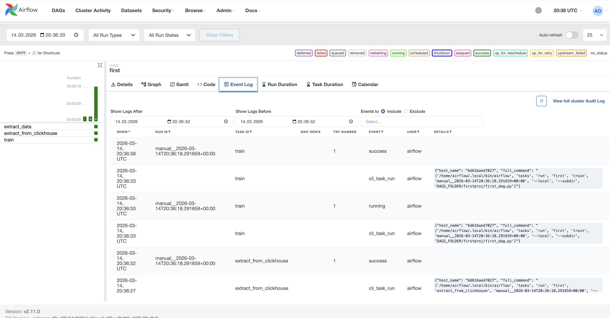
Из скриншотов видно, вдаг отработал успшено.

Отлично, всё получилось!


## __Задание 3: LakeFS__

В рамках задания была поднята локальная инфраструктура:

- **PostgreSQL** — метаданные lakeFS
- **MinIO** — S3-совместимое объектное хранилище
- **lakeFS** — система версионирования данных
- **lakectl** — CLI для работы с lakeFS

```bash
docker compose up -d
```
Для начала поднимаем Postgres


Далее поднимаем Minio


Заходим в Minio
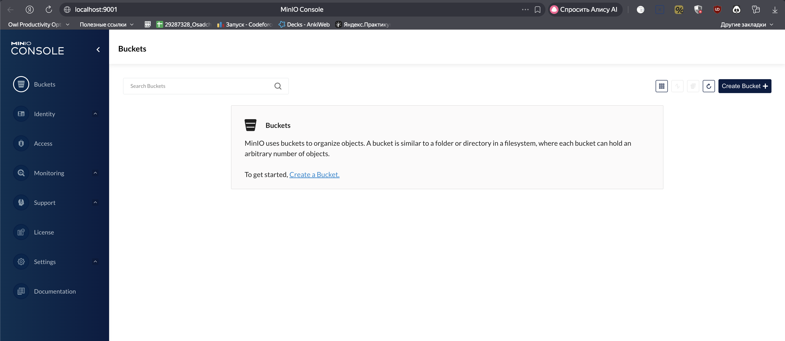

- MinIO Console -  http://localhost:9001
- MinIO S3 API - http://localhost:9000

Создаём бакет lakefs
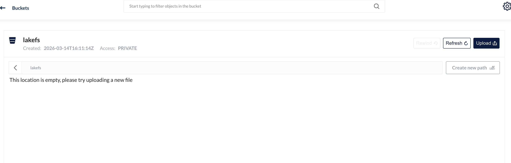

Поднимаем Lakefs
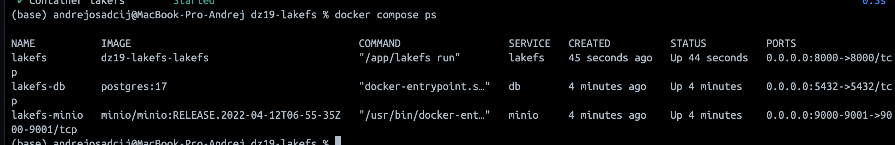

При первом запуске был выполнен setup:
```bash
http://localhost:8000/setup
```
В процессе настройки были созданы:
	•	Access Key
	•	Secret Key
  
Вводим данные и получаем credidentials
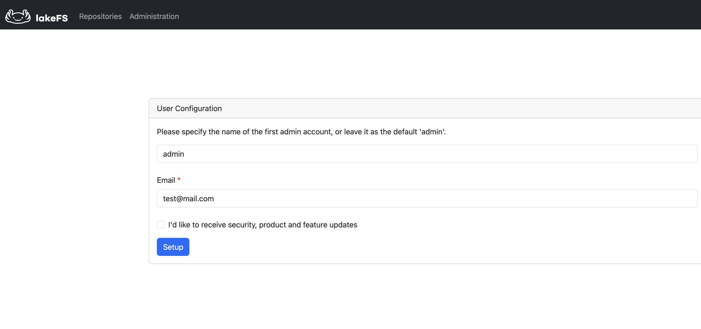
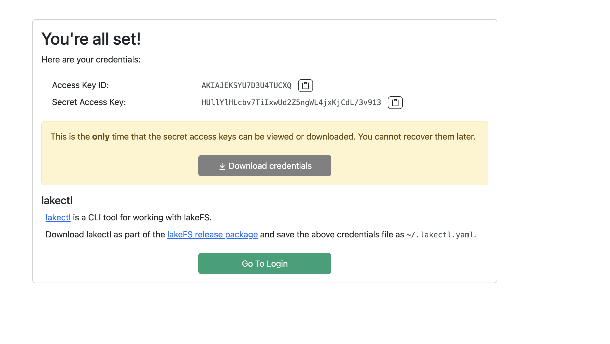
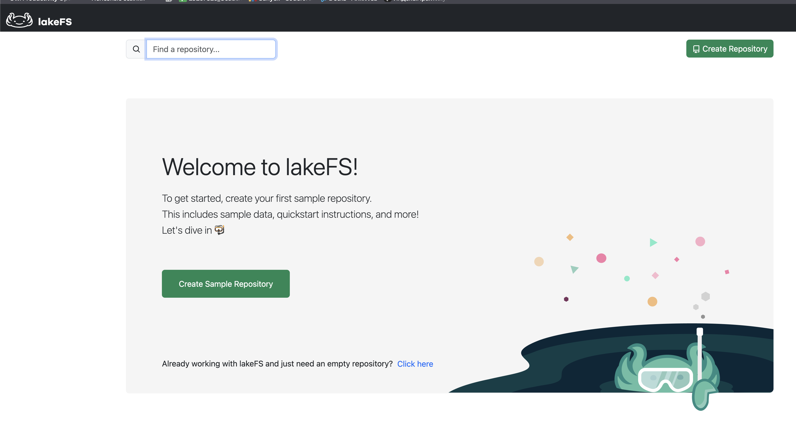

Эти ключи использовались для настройки CLI

После создаём репозиторий
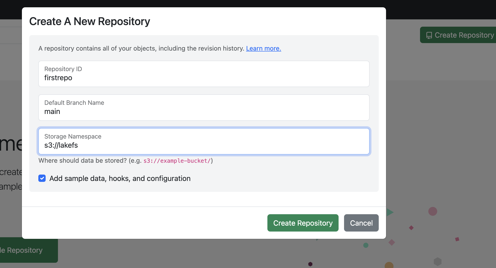


Была создана новая ветка
```bash
featone
```
Она используется как рабочая ветка для изменения данных.

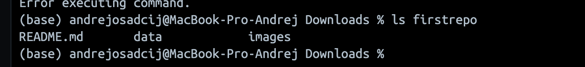

В репозиторий был добавлен новый файл:
```bash
echo "hello lakefs" > firstrepo/data.txt
```

Изменения были зафиксированы в lakeFS:


После compare main и featone был сделан merge
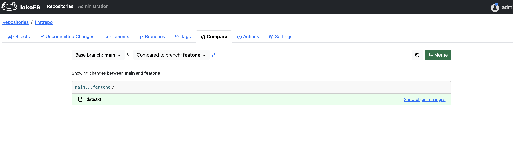

Итоговая структура репозитория

В ветке main находятся:
```bash
README.md
data.txt
data/
images/
lakes.parquet
```
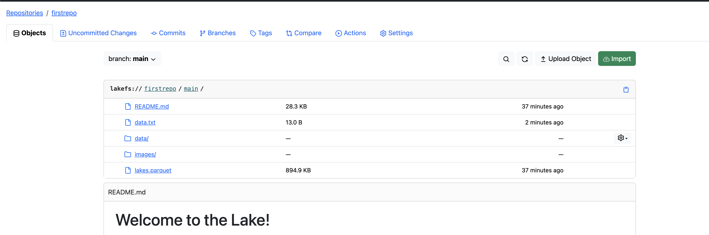

Отлично, всё получилось!

## Задание 4 jupyterhub
В рамках 4 задания был локально развернут jupyterhub сервер, были запущены в нем инстансы jupyterlab и проведены там исследования

### Структура проекта

```bash
02-airflow
│
├── Dockerfile
├── docker-compose.yaml
├── .env
│
└── data
    └── jph
        └── jupyterhub_config.py
```

### Dockerfile
```bash
python:3.14-slim
```
В контейнер устанавливаются:
- jupyterhub
- dockerspawner
- configurable-http-proxy
- sqlalchemy (<2)

### docker-compose.yaml
Docker Compose используется для запуска JupyterHub.

Основные параметры:
- порт 8000
- подключение docker.sock
- volume для хранения данных
- подключение конфигурационного файла JupyterHub

### Переменные окружения (.env)

Файл .env содержит ненастоящие секреты:
```bash
JPH_DUMMY_PASSWORD=jphadminpwd
```

### Сборка контейнера и запуск JupyterHub
```bash
docker compose build
```

```
docker compose up -d
```


### Проверка работы
После запуска сервис доступен по адресу:
```bash
http://localhost:8000
```

залогиниваемся
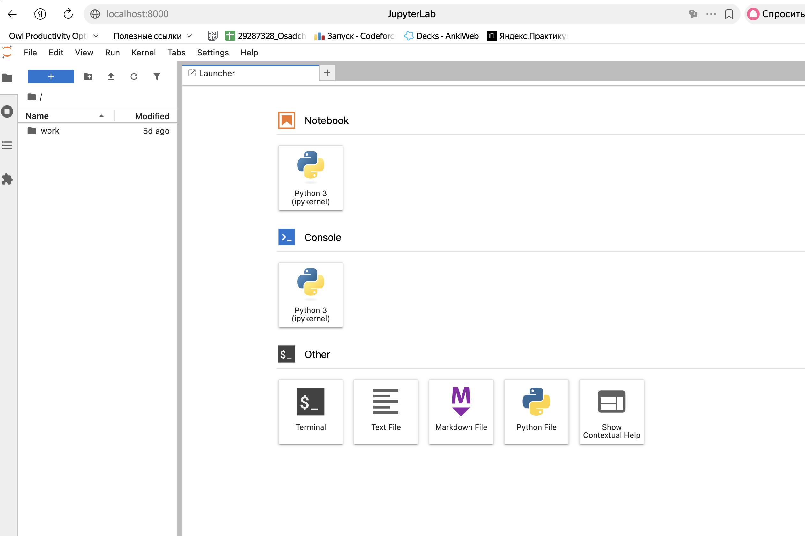
Всё работает, отлично!
  
