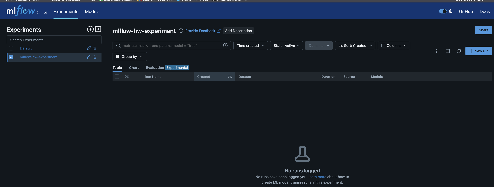
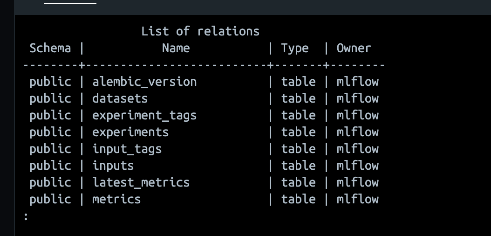
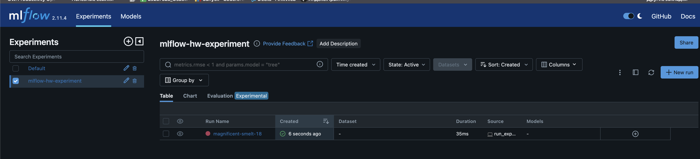

__Задание 1: MLFlow__


В рамках первого задания был развернут локальный сервер **MLflow** с использованием **Docker Compose**.

MLflow используется для:
- отслеживания экспериментов машинного обучения
- логирования параметров и метрик
- хранения артефактов моделей
- ведения реестра моделей

В данной работе был реализован локальный deployment MLflow с использованием:
- **MLflow server**
- **PostgreSQL** как backend store
- **Docker Compose** для оркестрации сервисов

---

# Архитектура решения

Использую следующие компоненты:

- **MLflow server** — веб-интерфейс и API для работы с экспериментами
- **PostgreSQL** — хранение метаданных экспериментов
- **MinIO** — объектное хранилище для артефактов (если используется вариант 2)

Схема:

``` id="ezz54h"
Python script / Jupyter
        |
        v
   MLflow server
        |
        v
 PostgreSQL (metadata)
        |
        v
   MinIO (artifacts)
```

```bash
mlflow-hw/
├── Dockerfile
├── docker-compose.yaml
├── .env
├── run_experiment.py
└── README.md
```
#### Dockerfile

В образ устанавливаются необходимые зависимости:
- mlflow
- psycopg2-binary
- gevent
- boto3

#### docker-compose.yaml
С помощью Docker Compose поднимаются сервисы:
- db — PostgreSQL
- mlflow — MLflow server
- minio — S3-compatible storage

#### Переменные окружения

В файле .env задаются:

__PostgreSQL__:
- POSTGRES_DB
- POSTGRES_USER
- POSTGRES_PASSWORD

__MLflow__:
- MLFLOW_SERVER_FILE_STORE

__MinIO__:
- AWS_ACCESS_KEY_ID
- AWS_SECRET_ACCESS_KEY
- AWS_BUCKET
- AWS_URL

### Запуск проекта

Сборка и запуск:
```bash
docker compose build
docker compose up -d
```

### Доступ к MLflow

После запуска интерфейс доступен по адресу:
```bash
http://localhost:8080
```

Создали эксперимент, важно убедиться, что MLflow создал таблицы.


Тестовый эксперимент

Для проверки работы MLflow был создан файл run_experiment.py

Содержимое файла:
```python
import mlflow

mlflow.set_tracking_uri("http://localhost:8080")
mlflow.set_experiment("mlflow-hw-experiment")

with mlflow.start_run():
    mlflow.log_param("learning_rate", 0.01)
    mlflow.log_param("batch_size", 32)
    mlflow.log_metric("accuracy", 0.95)
    mlflow.log_metric("loss", 0.12)

print("Experiment logged successfully")
```
Запуск:
```bash
python run_experiment.py
```
После выполнения в MLflow появился новый run с параметрами и метриками.


Отлично, всё получилось!
