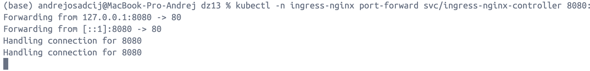
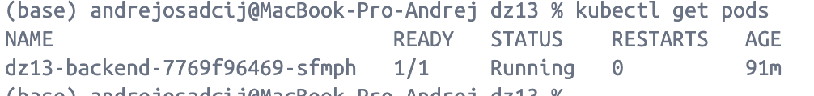
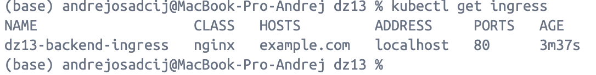
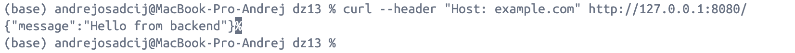

## ДЗ 13 — Введение в Kubernetes
### Дисциплина: DataOps
__Тема: Полный цикл контейнеризации и развёртывания веб-сервиса в Kubernetes__

## Описание сервиса

В рамках домашнего задания был реализован простой веб-сервис на FastAPI.

Сервис предоставляет:
- GET / — возвращает сообщение "Hello from backend"
- GET /healthz — endpoint для проверки состояния сервиса (используется Kubernetes-пробами)

Сервис предназначен для демонстрации полного цикла:
код => Docker => Kubernetes => Ingress => HTTP-доступ.

## Этап 1. Контейнеризация приложения (Docker)

Что было сделано
1. Написан простой FastAPI-сервис.
2. Создан Dockerfile, который:
  - использует python:3.11-slim
  - устанавливает зависимости
  - запускает приложение через uvicorn
3. Создан docker-compose.yaml для локального запуска
Результат

Сервис успешно запускается локально в Docker и отвечает на запросы:
```bash
curl http://localhost:8000/
curl http://localhost:8000/healthz
```
Это подтверждает корректность Docker-образа до развёртывания в Kubernetes.

## Этап 2. Публикация образа в Docker Hub

Собранный Docker-образ был загружен в Docker Hub:
```bash
andreosadchy/dz13-backend:v1
```

Образ успешно скачивается:
```bash
docker pull andreosadchy/dz13-backend:v1
```
Этот образ далее используется в Kubernetes Deployment.

## Этап 3. Развёртывание в Kubernetes
Для развёртывания сервиса были созданы следующие ресурсы Kubernetes:
1. Deployment
   Deployment отвечает за:
   - запуск Pod с контейнером приложения
   - контроль состояния Pod
   - автоматический перезапуск при сбоях

В Deployment настроены:
- startupProbe
- readinessProbe
- livenessProbe

Все пробы используют endpoint /healthz.

⸻

2. Service

Создан Service типа ClusterIP, который:
- предоставляет стабильную точку доступа к Pod-ам
- проксирует входящие запросы с порта 80 на порт 8000 контейнера

Таким образом:
- приложение внутри Pod слушает 8000
- внутри кластера сервис доступен на стандартном HTTP-порту 80

⸻

3. Ingress

Создан Ingress-ресурс, который:
- принимает HTTP-запросы с заголовком Host: example.com
- маршрутизирует их в Service приложения

Ingress работает через установленный ingress-nginx controller.

## Этап 4. Ingress Controller и доступ извне

Для обработки Ingress был установлен ingress-nginx controller.

В процессе настройки:
- контроллер не запускался из-за отсутствия label ingress-ready=true на ноде
- проблема была устранена добавлением label:
```bash
kubectl label node dev-control-plane ingress-ready=true
```

После этого:
- ingress-nginx controller успешно запустился
- admission webhook стал доступен
- Ingress-ресурс был создан без ошибок

## Этап 5. Проверка доступа к сервису

В окружении kind + Docker Desktop (macOS) NodePort не пробрасывается напрямую на 127.0.0.1.

Для проверки работы Ingress был использован port-forward:
```bash
kubectl -n ingress-nginx port-forward svc/ingress-nginx-controller 8080:80
```

Проверка доступа:
```bash
curl --header "Host: example.com" http://127.0.0.1:8080/
```
Ответ сервиса:
```bash
{"message":"Hello from backend"}
```
Итоговая цепочка запроса

Полный путь HTTP-запроса:
```bash
curl (localhost:8080)
→ kubectl port-forward
→ ingress-nginx-controller (service:80)
→ Ingress rule (Host: example.com)
→ dz13-backend Service (port 80)
→ Pod (containerPort 8000)
→ FastAPI application
```

## Проверочные команды

Для подтверждения корректной работы были выполнены команды:
```bash
kubectl get pods
kubectl get service
kubectl get ingress
curl --header "Host: example.com" http://127.0.0.1:8080/
```




## Итог
В ходе выполнения ДЗ:
- реализован и контейнеризирован веб-сервис
- выполнено развёртывание в Kubernetes
- настроены probes, Service и Ingress
- обеспечен внешний HTTP-доступ к приложению
