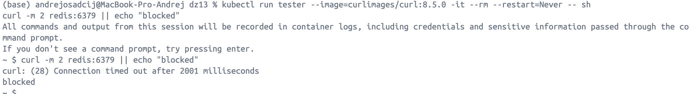
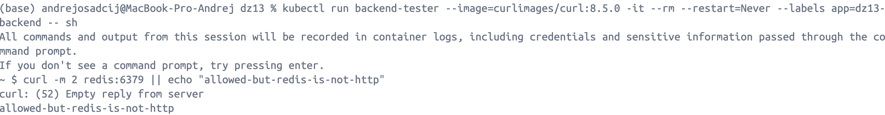
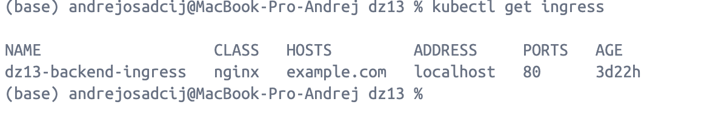
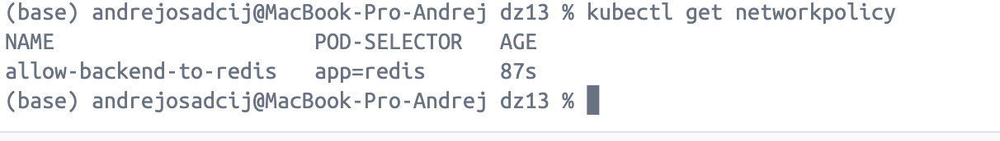
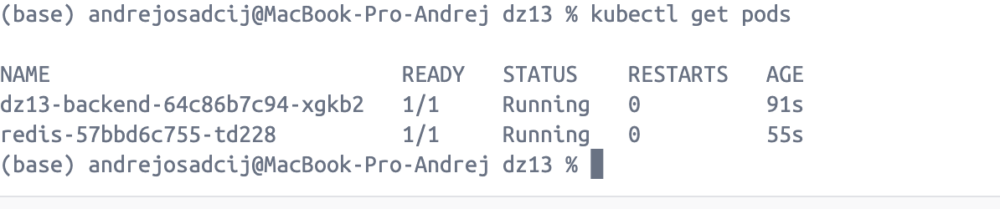
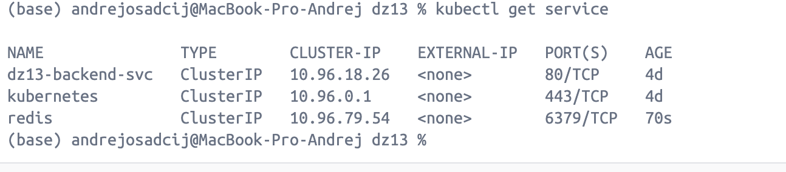

## ДЗ 14 — Kubernetes ресурсы
### Дисциплина: DataOps
__Тема: Управление ресурсами, shared memory и сетевая изоляция в Kubernetes__
Цель работы

Целью данного задания является практическое закрепление:
- управления ресурсами Pod-ов (CPU, Memory)
- настройки увеличенного shared memory (/dev/shm)
- развёртывания дополнительного сервиса (Redis)
- ограничения сетевого взаимодействия между Pod-ами с помощью NetworkPolicy

Работа выполнена на основе сервиса, реализованного в прошлом дз

## Исходные данные

В кластере Kubernetes уже был развёрнут:
- backend-сервис (FastAPI)
- Service и Ingress для доступа к backend
- ingress-nginx controller

## Этап 1. Ограничение ресурсов backend-приложения

Что сделано

В backend Deployment были добавлены ограничения ресурсов:
```yaml
resources:
  requests:
    cpu: 100m
    memory: 128Mi
  limits:
    cpu: 300m
    memory: 256Mi
```
- requests — гарантированный минимум ресурсов для Pod-а
- limits — верхняя граница, которую Pod не может превысить

Это защищает кластер от ситуации, когда один сервис потребляет все ресурсы ноды

## Этап 2. Увеличение shared memory (/dev/shm)

Для backend-приложения был добавлен emptyDir volume с типом Memory:
``yaml
volumes:
  - name: shm
    emptyDir:
      medium: Memory
      sizeLimit: 128Mi
```

И примонтирован в контейнер:
```yaml
volumeMounts:
  - name: shm
    mountPath: /dev/shm
```

По умолчанию /dev/shm в контейнерах Kubernetes очень мал.
Увеличение shared memory необходимо для корректной работы:
- Python-приложений
- IPC-механизмов
- некоторых библиотек и ML-фреймворков

## Этап 3. Развёртывание Redis

__Deployment__

Был развёрнут Redis как отдельный Deployment:
- образ: redis:7-alpine
- порт: 6379
- заданы requests и limits по CPU и памяти

__Service__

Для Redis создан Service типа ClusterIP, что означает:
- Redis доступен только внутри кластера
- доступ осуществляется по DNS-имени redis:6379

## Этап 4. Настройка NetworkPolicy

Создана NetworkPolicy, ограничивающая входящий трафик к Redis.

__Логика политики__

Redis принимает входящие соединения только от Pod-ов с меткой:
```bash
app=dz13-backend
```

Все остальные Pod-ы не имеют сетевого доступа к Redis.
```yaml
podSelector:
  matchLabels:
    app: redis
ingress:
  - from:
      - podSelector:
          matchLabels:
            app: dz13-backend
    ports:
      - port: 6379
```

## Этап 5. Проверка работы NetworkPolicy
Проверка “запрещено”

Pod без нужной метки не может подключиться к Redis:



Проверка “разрешено”

Pod с меткой app=dz13-backend может установить соединение:



Ответ Empty reply from server означает, что:
- сетевое соединение установлено
- Redis доступен
- Redis не является HTTP-сервисом

Это подтверждает корректную работу NetworkPolicy.
Проверочные команды

В ходе выполнения задания использовались команды:





Все ресурсы находятся в состоянии Running и работают корректно.

## Итого

В ходе выполнения ДЗ14:
- настроены лимиты и запросы ресурсов для backend
- увеличен shared memory контейнера
- развёрнут Redis как отдельный сервис
- реализована сетевая изоляция с помощью NetworkPolicy
- подтверждена корректная работа политики доступа
