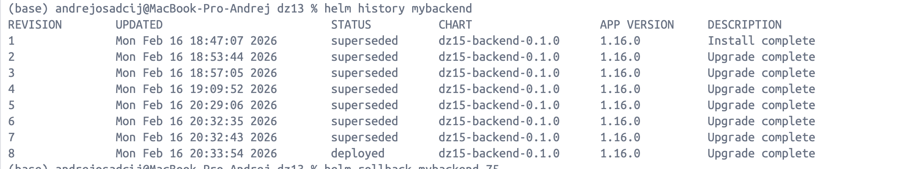
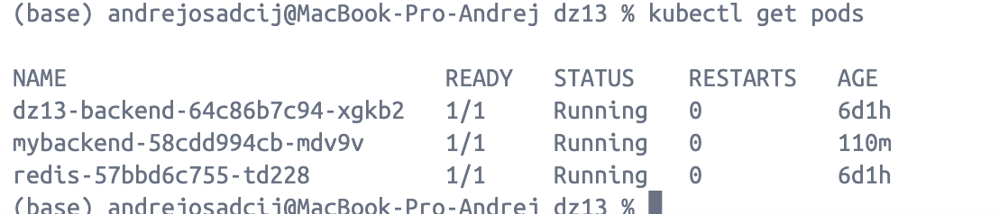

## ДЗ 15 — Helm
### Дисциплина: DataOps
__Тема: Пакетирование и управление Kubernetes-приложением с помощью Helm__
Цель работы:
- Создание Helm-чарта для ранее написанного hello-world (FastAPI) приложения.
- Реализация возможности менять версию Docker-образа через шаблоны.
- Реализация возможности включать/выключать лимиты и requests CPU/Memory.
- Реализация возможности включать/выключать генерацию манифеста Ingress.
- Деплой нескольких релизов в Kubernetes с разными конфигурациями.

###  📦 Структура Helm-чарта
```bash
dz15-backend/
  Chart.yaml
  values.yaml
  templates/
    deployment.yaml
    service.yaml
    ingress.yaml
```

values.yaml
Основные параметры, которыми управляет чарт:
```yaml
replicaCount: 1

image:
  repository: andreosadchy/dz13-backend
  tag: "v1"
  pullPolicy: IfNotPresent

service:
  type: ClusterIP
  port: 80

resources:
  enabled: true
  requests:
    cpu: 100m
    memory: 128Mi
  limits:
    cpu: 300m
    memory: 256Mi

ingress:
  enabled: true
  className: nginx
  host: example.com
```
Реализовано через шаблоны:
Смена версии образа

В deployment.yaml используется шаблон:
```yaml
image: "{{ .Values.image.repository }}:{{ .Values.image.tag }}"
```

Это позволяет менять версию образа через:
```yaml
helm upgrade mybackend ./dz15-backend --set image.tag=v2
```

Включение/выключение ресурсов

В шаблоне:
```
{{- if .Values.resources.enabled }}
resources:
  requests:
    cpu: {{ .Values.resources.requests.cpu }}
    memory: {{ .Values.resources.requests.memory }}
  limits:
    cpu: {{ .Values.resources.limits.cpu }}
    memory: {{ .Values.resources.limits.memory }}
{{- end }}
```

Отключение:
```
helm upgrade mybackend ./dz15-backend --set resources.enabled=false
```

Включение/выключение Ingress

В ingress.yaml:

```
{{- if .Values.ingress.enabled }}
kind: Ingress
...
{{- end }}
```

Отключение:
```yaml
helm upgrade mybackend ./dz15-backend --set ingress.enabled=false
```

Деплой нескольких релизов с разными настройками
1.Деплой нескольких релизов с разными настройками
```yaml
helm install backend-v1 ./dz15-backend \
  --set image.tag=v1 \
  --set ingress.enabled=true \
  --set resources.enabled=true
```
2. Без ingress и без ресурсов
```yaml
helm install backend-lite ./dz15-backend \
  --set image.tag=v1 \
  --set ingress.enabled=false \
  --set resources.enabled=false
```
3. Другая версия образа
```
helm install backend-v2 ./dz15-backend \
  --set image.tag=v2 \
  --set ingress.enabled=true \
  --set resources.enabled=true
```

Список релизов:
```yaml
helm list
```
Список Pod-ов:
```yaml
kubectl get pods
```
Список ingress:
```yaml
kubectl get ingress
```


Итог

В ходе выполнения ДЗ15:
- создан Helm-чарт для hello-world приложения
- реализована параметризация версии образа
- реализована возможность включения/выключения ресурсов
- реализована возможность включения/выключения ingress
- продемонстрировано развёртывание нескольких релизов с разными конфигурациями
