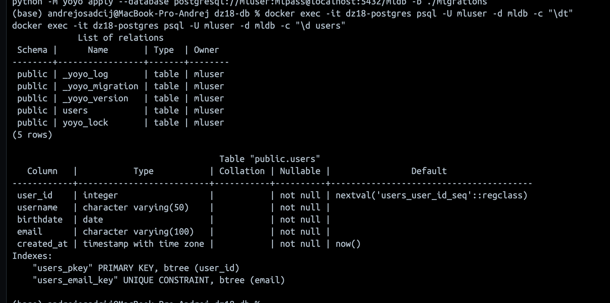
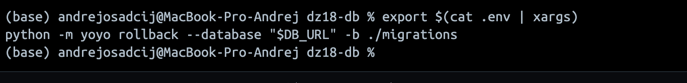
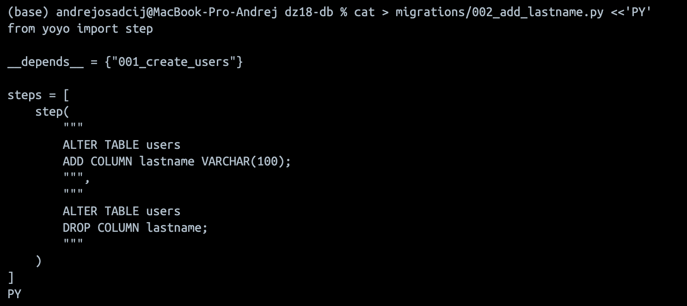
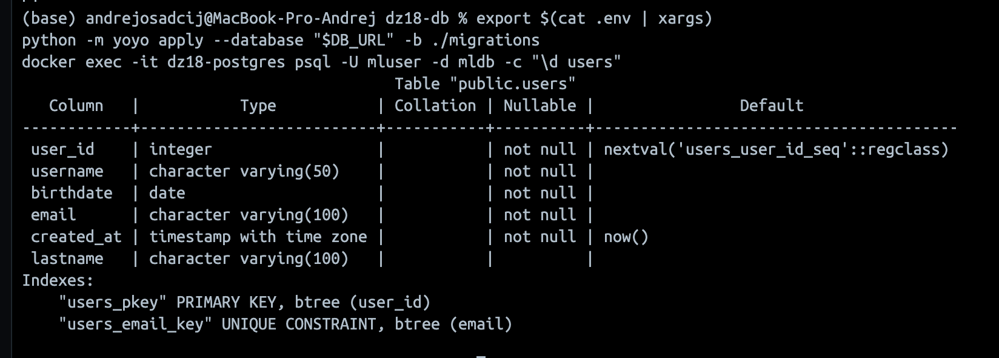

## ДЗ 18 —  DB migrations через yoyo
### Дисциплина: DataOps
__Тема: Работа с БД в ML-проектах__
Цель работы:
- научиться писать миграции баз данных в ML проектах на примере библиотеки yoyo-migrations

  
## DZ18 — DB migrations with yoyo

### Запускаем DB
docker compose up -d

### Создаём миграцию
```bash
export $(cat .env | xargs)
python -m yoyo apply --database "$DB_URL" -b ./migrations
```

### Rollback откатываем
```bash
python -m yoyo rollback --database "$DB_URL" -b ./migrations
```

### Проверяем новую миграцию
```bash
docker exec -it dz18-postgres psql -U mluser -d mldb -c "\d users"
```


