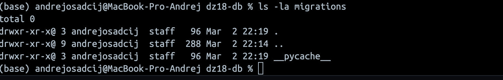

## ДЗ 18 —  DB migrations через yoyo
### Дисциплина: DataOps
__Тема: Работа с БД в ML-проектах__
Цель работы:
- научиться писать миграции баз данных в ML проектах на примере библиотеки yoyo-migrations

  
## DZ18 — DB migrations with yoyo

### Run DB
docker compose up -d

### Apply migrations
export $(cat .env | xargs)
python -m yoyo apply --database "$DB_URL" -b ./migrations

### Rollback last migration
python -m yoyo rollback --database "$DB_URL" -b ./migrations

### Check schema
docker exec -it dz18-postgres psql -U mluser -d mldb -c "\d users"
