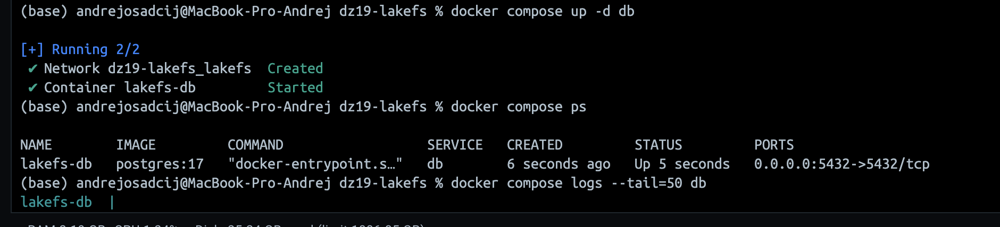
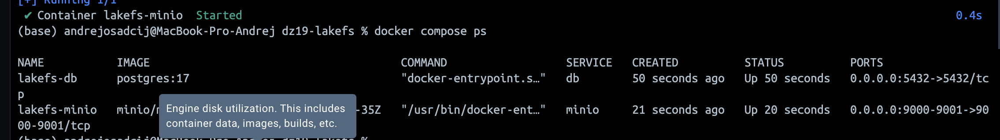
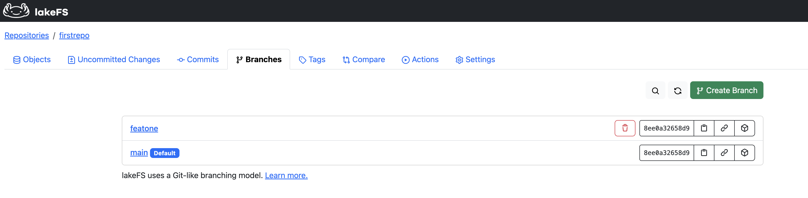
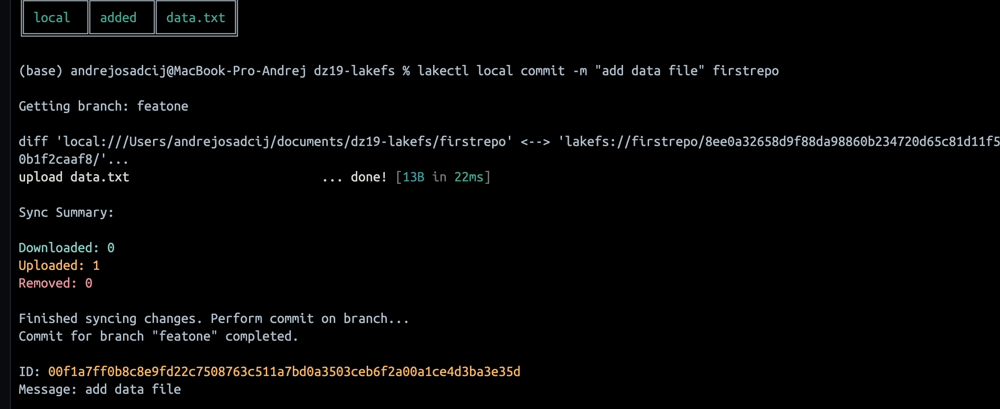

## ДЗ 19 —  DVC
### Дисциплина: DataOps
__Тема: DVC__
### Цель - научиться локально разворачивать lakefs сервер, создавать в нем репозитории и версионировать датасеты.

### Архитектура решения

В рамках задания была поднята локальная инфраструктура:

- **PostgreSQL** — метаданные lakeFS
- **MinIO** — S3-совместимое объектное хранилище
- **lakeFS** — система версионирования данных
- **lakectl** — CLI для работы с lakeFS

```bash
docker compose up -d
```
Для начала поднимаем Postgres


Далее поднимаем Minio


Заходим в Minio


- MinIO Console -  http://localhost:9001
- MinIO S3 API - http://localhost:9000

Создаём бакет lakefs


Поднимаем Lakefs


При первом запуске был выполнен setup:
```bash
http://localhost:8000/setup
```
В процессе настройки были созданы:
	•	Access Key
	•	Secret Key
  
Вводим данные и получаем credidentials


Эти ключи использовались для настройки CLI

После создаём репозиторий



Была создана новая ветка
```bash
featone
```
Она используется как рабочая ветка для изменения данных.


В репозиторий был добавлен новый файл:
```bash
echo "hello lakefs" > firstrepo/data.txt
```

Изменения были зафиксированы в lakeFS:


После compare main и featone был сделан merge


Итоговая структура репозитория

В ветке main находятся:
```bash
README.md
data.txt
data/
images/
lakes.parquet
```


Отлично, всё получилось!
