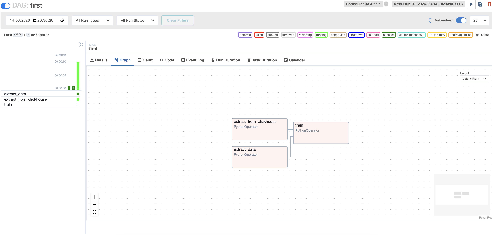

# Homework 23 — Apache Airflow

### Дисциплина: DataOps
__Тема: MLFlow__
### Цель - научиться локально разворачивать airflow сервер, создавать пайплайны и зависимые задачи.

В рамках домашнего задания был развернут локальный кластер Apache Airflow с использованием Docker Compose.
Airflow используется для оркестрации и автоматизации пайплайнов обработки данных (ETL / ML pipelines).

В работе была реализована следующая архитектура:
- Apache Airflow Webserver — веб-интерфейс для управления DAG
- Apache Airflow Scheduler — планирование и запуск задач
- Apache Airflow Triggerer — обработка асинхронных триггеров
- PostgreSQL — backend database для хранения метаданных Airflow

Архитектура пайплайна:
```bash
            +------------------+
            |  Airflow UI      |
            |  (Webserver)     |
            +---------+--------+
                      |
                      v
            +------------------+
            |    Scheduler     |
            +---------+--------+
                      |
                      v
           +---------------------+
           |        DAG          |
           |                     |
           | extract_data       |
           | extract_clickhouse |
           |        ↓           |
           |        train       |
           +---------------------+

                      |
                      v
                PostgreSQL
           (Airflow metadata DB)
```

### Структура проекта
```bash
airflow-hw/
├── docker-compose.yaml
├── .env
└── data/
    └── airflow/
        └── dags/
            ├── __init__.py
            └── firstproj/
                ├── __init__.py
                ├── first_dag.py
                └── runner.py
```

### Переменные окружения

Файл .env содержит конфигурацию для Postgres и Airflow.

PostgreSQL
```bash
POSTGRES_PASSWORD=airflowdbpwd
```

Airflow database connection
```bash
AIRFLOW__CORE__SQL_ALCHEMY_CONN=postgresql://airflow:airflowdbpwd@db:5432/airflow
```

Secret key
```bash
APP_SECRET_KEY=airflowsecretkey
```

### Запуск проекта

1. Запуск PostgreSQL
```bash
docker compose up -d db
```

2. Инициализация базы данных Airflow
```bash
docker compose up airflow.db.init
```

3. Применение миграций
```bash
docker compose up airflow.db.migrate
```

4. Запуск основных сервисов Airflow
```bash
docker compose up -d airflow.webserver
docker compose up -d airflow.scheduler
docker compose up -d airflow.triggerer
```

### Доступ к Airflow

После запуска веб-интерфейс доступен по адресу:
```bash
http://localhost:8080
```

#### Создание администратора

Для доступа к интерфейсу был создан пользователь admin.

Выполняется внутри контейнера:
```bash
docker compose exec -it airflow.webserver bash

airflow users create \
  --username admin \
  --firstname Andrey \
  --lastname Osad \
  --role Admin \
  --email admin@example.org
```


###  DAG

В проекте реализован DAG first => data/airflow/dags/firstproj/first_dag.py

конфигурация:
```python
dag = DAG(
    "first",
    schedule="33 4 * * *",
    start_date=datetime.fromisoformat("2026-02-10T10:10:10+00:00"),
    catchup=False,
)
```

Реализованные задачи

В DAG реализованы три задачи:

- extract_data (Имитация извлечения данных.)
- extract_from_clickhouse (Имитация загрузки данных из ClickHouse.)
- train (Имитация обучения модели.)

__Зависимости задач__
```bash
extract_data
extract_from_clickhouse
        ↓
       train
```
### Запуск DAG

DAG запускается вручную через интерфейс Airflow.

Шаги:
1. открыть DAGs
2. включить DAG first
3. нажать Trigger DAG
После запуска задачи выполняются последовательно.


Из скриншотов видно, вдаг отработал успшено.
Отлично, всё получилось!
