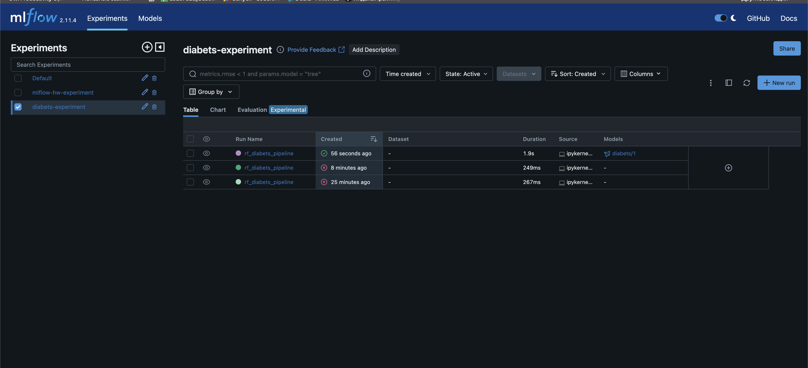
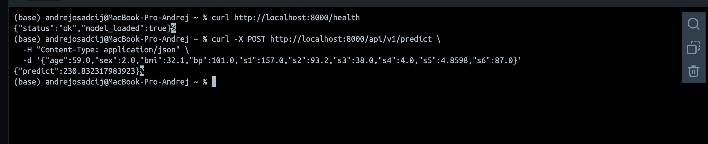

# ДЗ 24 — Полноценный MLсервис с FastApi

### Дисциплина: DataOps
__Тема: Полноценный ML-сервис__
### Цель - научиться следовать циклу создания и развития мл сервиса, в рамках которого будет обучена модель c фиксацией параметров обучения, полученные артефакты будут зафиксированны в реестре моделей mlflow и использованы в ML сервисе.

## Описание

В рамках домашнего задания был реализован полный цикл работы с моделью машинного обучения:

1. обучение модели на датасете `diabetes`
2. логирование параметров и метрик в **MLflow**
3. регистрация модели в **MLflow Model Registry**
4. загрузка зарегистрированной модели
5. развёртывание веб-сервиса на **FastAPI**
6. получение предсказания через REST API

---

# Архитектура решения

Проект состоит из двух основных частей:

## 1. Обучение и регистрация модели
Модель обучается в Jupyter Notebook и сохраняется в MLflow.

## 2. Веб-сервис FastAPI
Сервис загружает сохранённую модель и предоставляет endpoint для инференса.

Схема работы:

```text
Jupyter Notebook
      |
      v
   MLflow Server
      |
      v
Registered Model: diabets
      |
      v
mlflow.sklearn.load_model(...)
      |
      v
diabets_model.pkl
      |
      v
FastAPI service
      |
      v
POST /api/v1/predict
```

## Структура проекта
mlservice_hw24/
├── Dockerfile
├── docker-compose.yaml
├── README.md
├── requirements.txt
├── model/
│   └── diabets_model.pkl
├── mlapp/
│   ├── __main__.py
│   └── server.py
└── research/
    └── train.ipynb

### Часть 1. Обучение и регистрация модели
```text
research/train.ipynb
```

В ноутбуке выполняются следующие шаги:
	•	загрузка датасета load_diabetes(scaled=False)
	•	разбиение на train/test
	•	обучение pipeline:
	•	StandardScaler
	•	RandomForestRegressor
	•	расчёт метрик:
	•	mae
	•	r2
	•	логирование параметров и метрик в MLflow
	•	логирование модели
	•	регистрация модели в Model Registry под именем: diabets

  После выполнения ноутбука в MLflow появился experiment:diabets-experiment
  и зарегистрированная модель:diabets / version 1

### Часть 2. Загрузка модели

После регистрации модель была загружена из MLflow и сохранена локально: model/diabets_model.pkl

### Часть 3. FastAPI сервис

Файл: mlapp/server.py

Сервис принимает 10 признаков пациента:
- age
- sex
- bmi
- bp
- s1
- s2
- s3
- s4
- s5
- s6

и возвращает предсказание модели.
Запуск сервиса

Из корня проекта:
```bash
python -m mlapp
```

Сервис становится доступен по адресу:
```text
http://localhost:8000
```

### Проверка работоспособности

Проверка модели:

