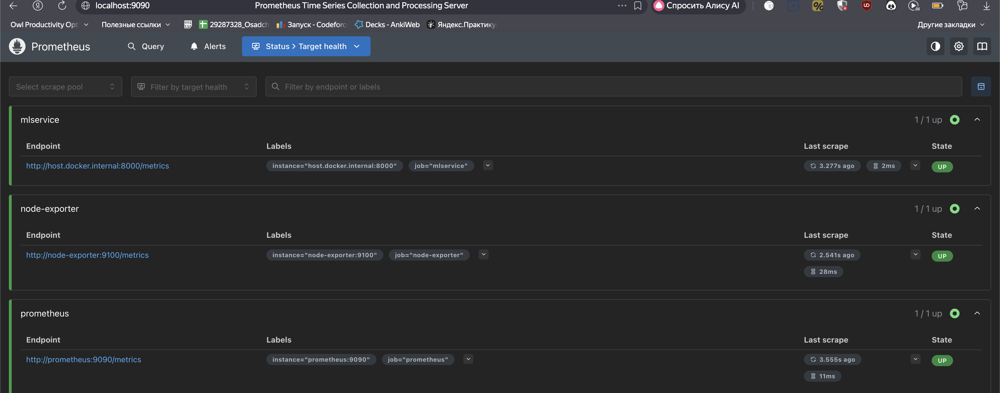
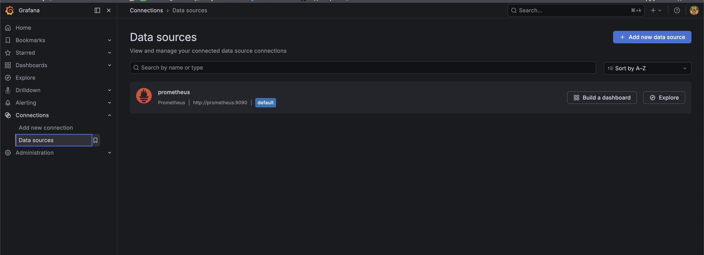
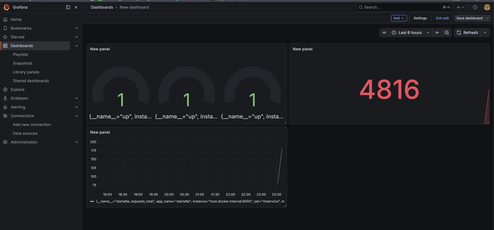

## ДЗ 25 —  Мониторинг и Логирование
### Дисциплина: DataOps
__Тема: Мониторинг и Логирование__
### Цель - научиться локально разворачивать сервисы prometheus, grafana, node exporter и использовать их для отслеживания метрик работы ML сервиса

ML-сервис был доработан с использованием `starlette-exporter`, чтобы Prometheus мог собирать метрики HTTP-запросов и состояния сервиса.

---

## Архитектура решения

```text
Client / curl
      |
      v
FastAPI ML service (localhost:8000)
      |
      v
   /metrics
      |
      v
Prometheus (localhost:9090)
      |
      v
Grafana (localhost:3000)
      |
      v
Dashboards
```
Дополнительно:
- node-exporter предоставляет системные метрики CPU и др.

### Структура проекта
```text
mlservice_hw24/
├── Dockerfile
├── docker-compose.yaml
├── .env
├── configs/
│   └── prometheus.yml
├── mlapp/
│   ├── __main__.py
│   └── server.py
├── model/
│   └── diabets_model.pkl
└── research/
    └── train.ipynb
```
Используемые сервисы

#### ML service

__FastAPI сервис с endpoint’ами__:
- GET /health
- POST /api/v1/predict
- GET /metrics

__Prometheus__
Собирает метрики с:
- самого себя
- ML сервиса
- node-exporter

__Grafana__
Используется для создания dashboard и визуализации метрик.

__node-exporter__
Предоставляет системные метрики, в том числе CPU.

#### Доработка FastAPI сервиса

В mlapp/server.py были добавлены:
```python
from starlette_exporter import PrometheusMiddleware, handle_metrics

app.add_middleware(PrometheusMiddleware)
app.add_route("/metrics", handle_metrics)
```

Это позволило Prometheus собирать метрики сервиса по пути:
```text
http://localhost:8000/metrics
```

docker-compose.yaml

В проект были добавлены сервисы:
- mlservice
- prometheus
- grafana
- node-exporter

Запуск всего стека:

```bash
docker compose up -d --build
```

Переменные окружения

Файл .env:

```text
GF_SECURITY_ADMIN_USER=admin
GF_SECURITY_ADMIN_PASSWORD=admin123
```

### Проверка Prometheus

Prometheus доступен по адресу:

```text
http://localhost:9090
```




### Проверка Grafana

Grafana доступна по адресу:

```text
http://localhost:3000
```
В Grafana был создан datasource:


### Dashboard
Был создан dashboard с графиками.


Отлично, всё получилось!
