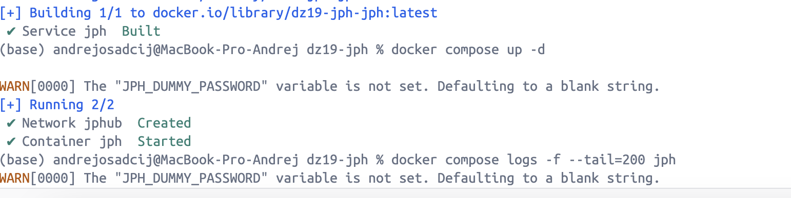
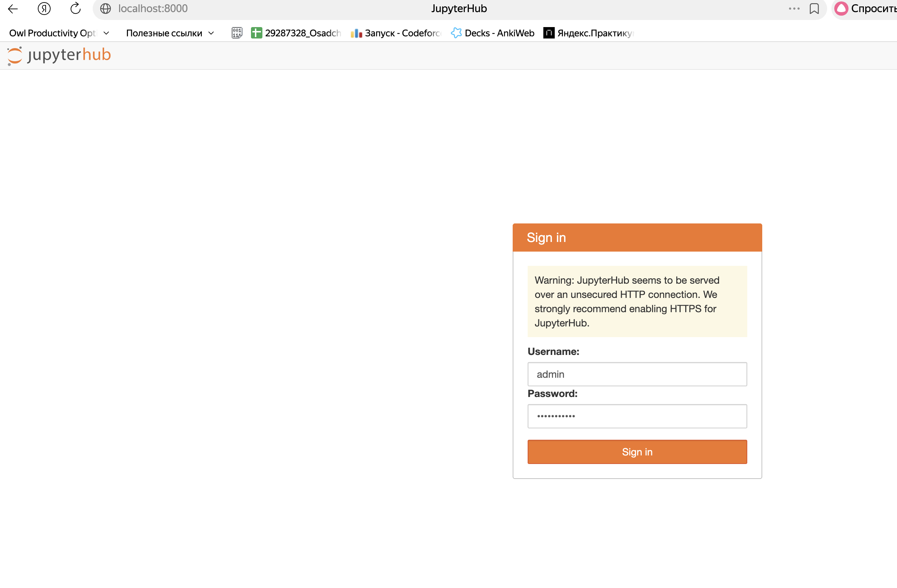

## ДЗ 19 —  JPH
### Дисциплина: DataOps
__Тема: Работа с БД в ML-проектах__

#### Цель работы:
- научиться локально разворачивать jupyterhub сервер, запускать в нем инстансы jupyterlab и проводить там исследования

### Структура проекта

```bash
dz19-jph
│
├── Dockerfile
├── docker-compose.yaml
├── .env
│
└── data
    └── jph
        └── jupyterhub_config.py
```

### Dockerfile
```bash
python:3.14-slim
```
В контейнер устанавливаются:
- jupyterhub
- dockerspawner
- configurable-http-proxy
- sqlalchemy (<2)

### docker-compose.yaml
Docker Compose используется для запуска JupyterHub.

Основные параметры:
- порт 8000
- подключение docker.sock
- volume для хранения данных
- подключение конфигурационного файла JupyterHub

### Переменные окружения (.env)

Файл .env содержит ненастоящие секреты:
```bash
JPH_DUMMY_PASSWORD=jphadminpwd
```

### Сборка контейнера и запуск JupyterHub
```bash
docker compose build
```

```
docker compose up -d
```


### Проверка работы
После запуска сервис доступен по адресу:
```bash
http://localhost:8000
```

залогиниваемся

Всё работает, отлично!
  
